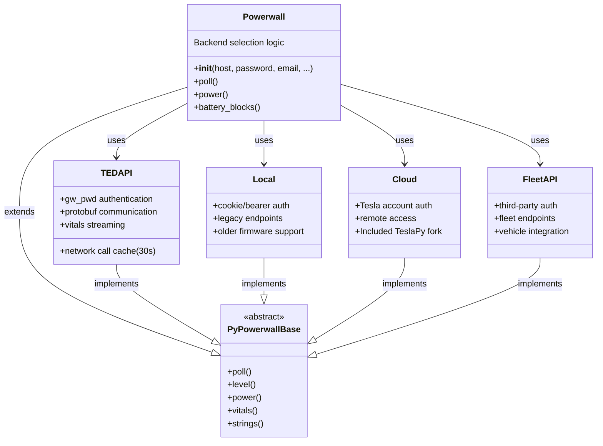
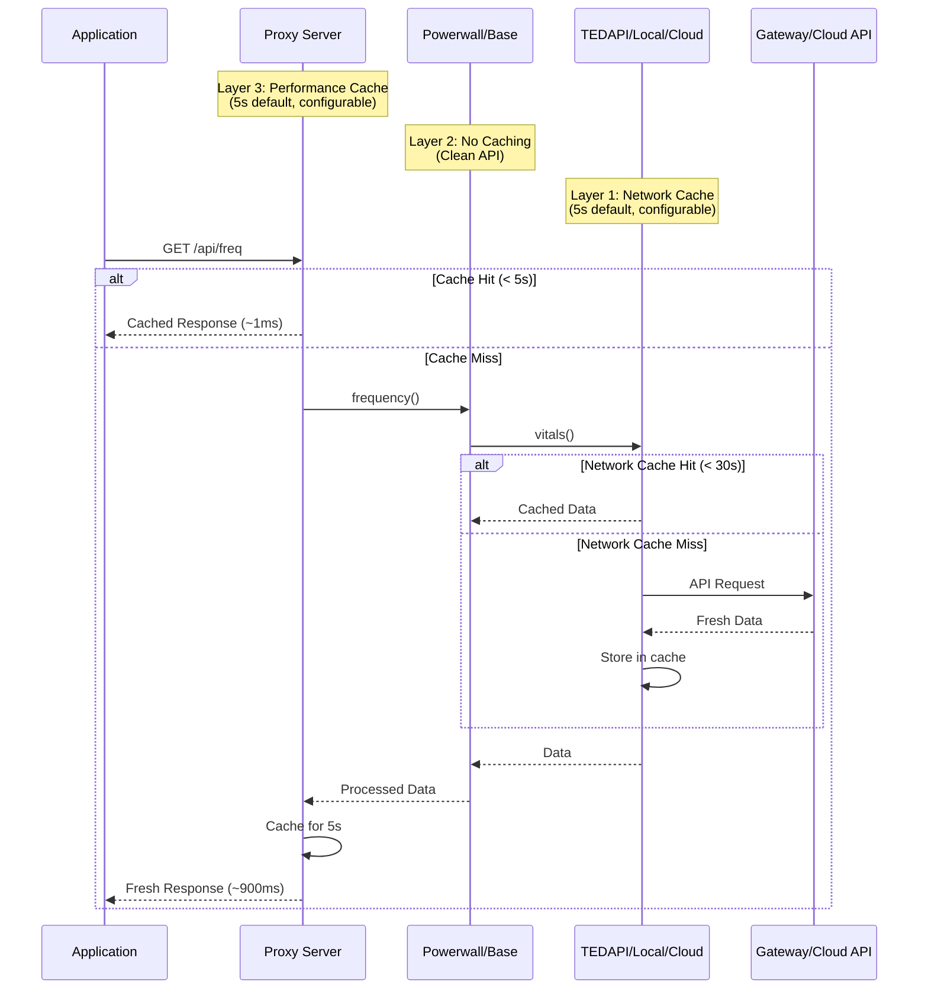
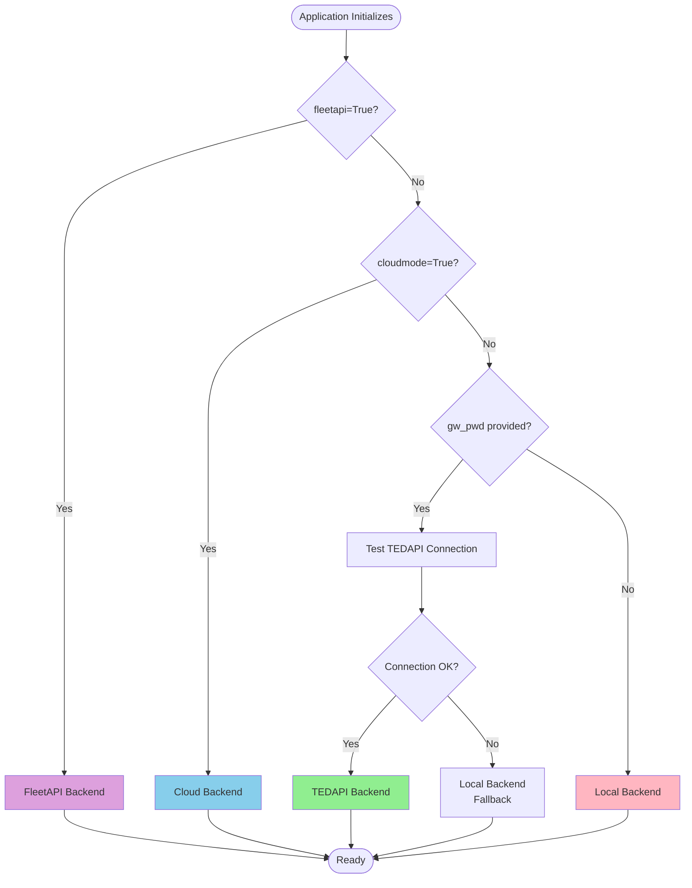

# PyPowerwall Python API Documentation

PyPowerwall is a Python library for interfacing with the Tesla Solar Powerwall Gateway. This document provides an overview of the main classes and functions available for users and developers.

---

## Getting Started

Install the required dependencies:

```sh
pip install requests protobuf
```

Import the library in your Python code:

```python
import pypowerwall
```

Create a Powerwall instance:

```python
pw = pypowerwall.Powerwall(host="<gateway-ip>", password="<gateway-password>", email="<tesla-email>")
```

---

## Main Class: `Powerwall`

### Initialization

```python
pw = pypowerwall.Powerwall(
    host="<gateway-ip>",
    password="<gateway-password>",
    email="<tesla-email>",
    timezone="America/Los_Angeles",
    pwcacheexpire=5,
    timeout=5,
    poolmaxsize=10,
    cloudmode=False,
    siteid=None,
    authpath="",
    authmode="cookie",
    cachefile=".powerwall",
    fleetapi=False,
    auto_select=False,
    retry_modes=False,
    gw_pwd=None
)
```

**Parameters:**
- `host`: Hostname or IP of the Tesla gateway
- `password`: Customer password for gateway
- `email`: Customer email for gateway/cloud
- `timezone`: Timezone string
- `pwcacheexpire`: API cache timeout in seconds
- `timeout`: HTTPS call timeout in seconds
- `poolmaxsize`: HTTP connection pool size
- `cloudmode`: Use Tesla cloud API (default: False)
- `siteid`: Site ID for cloud mode
- `authpath`: Path to cloud auth/site files
- `authmode`: "cookie" or "token" (default: "cookie")
- `cachefile`: Path to cache file
- `fleetapi`: Use Tesla FleetAPI (default: False)
- `auto_select`: Auto-select best connection mode
- `retry_modes`: Retry connection attempts
- `gw_pwd`: Gateway password for TEDAPI mode

---

## Common Methods

### System and Status

- `is_connected()` → bool  
  Returns True if able to connect and login to Powerwall.

- `status(param=None, jsonformat=False)` → dict/str/None  
  Returns system status. If `param` is provided, returns only that parameter.

- `site_name()` → str/None  
  Returns the site name.

- `version(int_value=False)` → str/int/None  
  Returns firmware version (as string or int).

- `uptime()` → str/None  
  Returns system uptime in seconds.

- `din()` → str/None  
  Returns the system DIN.

### Power and Energy

- `level(scale=False)` → float/None  
  Returns battery power level percentage.

- `power()` → dict  
  Returns power data for site, solar, battery, and load.

- `site(verbose=False)` → dict  
  Returns site sensor data (W or raw JSON if verbose=True).

- `solar(verbose=False)` → dict  
  Returns solar sensor data (W or raw JSON if verbose=True).

- `battery(verbose=False)` → dict  
  Returns battery sensor data (W or raw JSON if verbose=True).

- `load(verbose=False)` → dict  
  Returns load sensor data (W or raw JSON if verbose=True).

- `grid(verbose=False)` → dict  
  Alias for `site()`.

- `home(verbose=False)` → dict  
  Alias for `load()`.

### Device and System Data

- `vitals(jsonformat=False)` → dict/str  
  Returns Powerwall device vitals.

- `strings(jsonformat=False, verbose=False)` → dict/str  
  Returns solar panel string data.

- `temps(jsonformat=False)` → dict/str  
  Returns Powerwall temperatures.

- `alerts(jsonformat=False, alertsonly=True)` → list/str  
  Returns array of alerts from devices.

- `system_status(jsonformat=False)` → dict/str  
  Returns the system status.

- `battery_blocks(jsonformat=False)` → dict/str  
  Returns battery-specific information merged from system status and vitals.

- `grid_status(type="string")` → str/int/None  
  Returns the power grid status. `type` can be "string" (default), "json", or "numeric".
    - "string": "UP", "DOWN", "SYNCING"
    - "numeric": -1 (Syncing), 0 (DOWN), 1 (UP)

### Battery and Operation

- `get_reserve(scale=True, force=False)` → float/None  
  Get battery reserve percentage.

- `get_mode(force=False)` → str/None  
  Get current battery operation mode.

- `set_reserve(level)` → dict/None  
  Set battery reserve percentage.

- `set_mode(mode)` → dict/None  
  Set current battery operation mode.

- `set_operation(level=None, mode=None, jsonformat=False)` → dict/str/None  
  Set battery reserve percentage and/or operation mode.

- `get_time_remaining()` → float/None  
  Get the backup time remaining on the battery (in hours).

### Grid and Export

- `set_grid_charging(mode)` → dict/None  
  Enable or disable grid charging (`mode` = True/False).

- `get_grid_charging()` → bool/None  
  Get the current grid charging mode.

- `set_grid_export(mode)` → dict/None  
  Set grid export mode (`mode` = "battery_ok", "pv_only", "never").

- `get_grid_export()` → str/None  
  Get the current grid export mode.

---

## Example Usage

```python
import pypowerwall

pw = pypowerwall.Powerwall(host="10.0.1.99", password="yourpassword", email="your@email.com")

if pw.is_connected():
    print("Connected to Powerwall!")
    print("Site Name:", pw.site_name())
    print("Battery Level:", pw.level())
    print("Grid Status:", pw.grid_status())
    print("Alerts:", pw.alerts())
else:
    print("Failed to connect to Powerwall.")
```

---

## Advanced Topics

- **Cloud Mode:** Set `cloudmode=True` and provide your Tesla account email to use the Tesla Cloud API.
- **FleetAPI:** Set `fleetapi=True` to use Tesla FleetAPI (requires setup).
- **TEDAPI:** Use `gw_pwd` for TEDAPI mode (advanced/local diagnostics).
- **Caching:** The library caches API responses for 5 seconds by default (`pwcacheexpire`).
- **Authentication:** Supports both cookie and bearer token authentication (`authmode`).

---

## Requirements

- Python 3.7+
- `requests`, `protobuf`

Install requirements:

```sh
pip install -r requirements.txt
```

## TeslaPy

**Note:** TeslaPy is included as a patched fork within pypowerwall and does not need to be installed separately. The fork was created because the original project is mostly unmaintained and necessary bug fixes were not being accepted by the maintainers. You can access it if needed:

```python
from pypowerwall.cloud import teslapy
```

---

## Architecture

pypowerwall uses a modular architecture with multiple backend implementations and a sophisticated multi-tier caching system to optimize performance and reliability.

### Component Overview

The library consists of several key components:

- **Powerwall (Main Class)**: High-level interface that automatically selects the appropriate backend
- **PyPowerwallBase**: Abstract base class defining the core API interface
- **Backend Implementations**: 
  - **TEDAPI** - Tesla Energy Device API for local communication via gateway
  - **Local** - Legacy local API for older Powerwall firmware
  - **Cloud** - Tesla Cloud API for remote access
  - **FleetAPI** - Tesla Fleet API for third-party integrations
- **Proxy Server**: HTTP server that wraps pypowerwall and adds performance caching

### Class Hierarchy



### Data Flow and Caching Architecture

pypowerwall implements a 3-tier caching system for optimal performance:



### Connection Mode Selection

The Powerwall class automatically selects the appropriate backend based on configuration:



### Backend Comparison

| Feature | TEDAPI | Local | Cloud | FleetAPI |
|---------|--------|-------|-------|----------|
| **Connection** | Local Gateway | Local Gateway | Internet | Internet |
| **Authentication** | Gateway Password | Cookie/Token | Tesla Account | OAuth Token |
| **Firmware Support** | Recent (23.44.0+) | Legacy | All | All |
| **Response Speed** | Fast (~300ms) | Fast (~300ms) | Slower (~1-2s) | Slower (~1-2s) |
| **Vitals Streaming** | Yes | Limited | No | Limited |
| **Offline Operation** | Yes | Yes | No | No |
| **Network Cache** | Yes (5s) | No | No | No |
| **Best For** | PW3, Recent PW2+ | Older Systems | Remote Access | Third-party Apps |

### Caching Strategy

pypowerwall implements intelligent caching at multiple levels:

**Layer 1: Backend Network Cache** (TEDAPI only)
- Default TTL: 5 seconds (configurable via `pwcacheexpire`)
- Caches raw API responses from gateway
- Reduces network calls for repeated requests
- Logs cache age/expire for debugging

**Layer 2: Base Library**
- No caching (by design)
- Clean API boundary
- Always returns fresh data from backend
- Simplifies testing and reasoning

**Layer 3: Proxy Server Performance Cache**
- Default TTL: 5 seconds (configurable via `PW_CACHE_EXPIRE`)
- Caches processed responses for high-frequency endpoints
- Dramatically improves response time (900ms → <1ms)
- Used for: `/api/csv`, `/api/freq`, `/api/pod`, `/api/json`
- Separate cache keys per endpoint
- Thread-safe with locks

**Layer 3b: Proxy Graceful Degradation Cache**
- Default TTL: 15 seconds (configurable via `PW_CACHE_TTL_SECONDS`)
- Stores last successful response
- Used when gateway is unreachable
- Prevents service interruption during brief outages

### Example: Request Flow for `/api/freq`

1. **Application** makes HTTP request to proxy server
2. **Proxy** checks performance cache (5s TTL)
   - If hit: Returns cached data immediately (~1ms)
   - If miss: Proceeds to step 3
3. **Proxy** calls multiple pypowerwall methods:
   - `system_status()` - battery blocks
   - `vitals()` - detailed metrics
   - `grid_status()` - grid connection state
4. **Base Library** forwards calls to backend (no caching)
5. **TEDAPI Backend** checks network cache (5s TTL)
   - If hit: Returns cached data
   - If miss: Makes protobuf API call to gateway
6. **Response** flows back through layers
7. **Proxy** caches processed response for 5 seconds
8. **Application** receives consolidated frequency data

This architecture provides:
- **Performance**: Sub-millisecond cached responses
- **Reliability**: Graceful degradation during outages
- **Flexibility**: Multiple backend support
- **Observability**: Cache logging for debugging

---

## More Information

- [GitHub Repository](https://github.com/jasonacox/pypowerwall)
- [CONTRIBUTING.md](CONTRIBUTING.md)
- [RELEASE.md](RELEASE.md)
