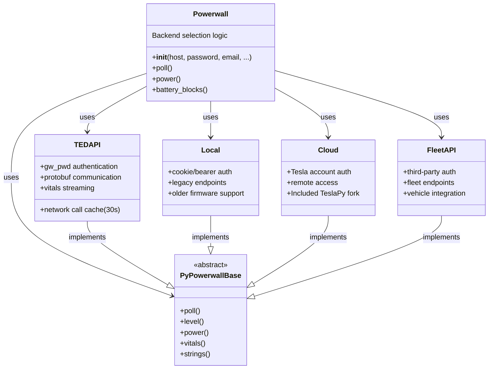
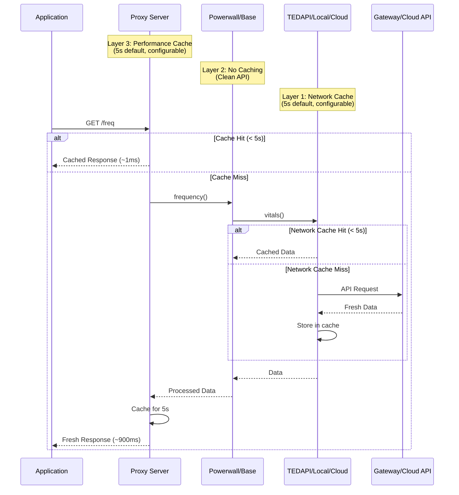
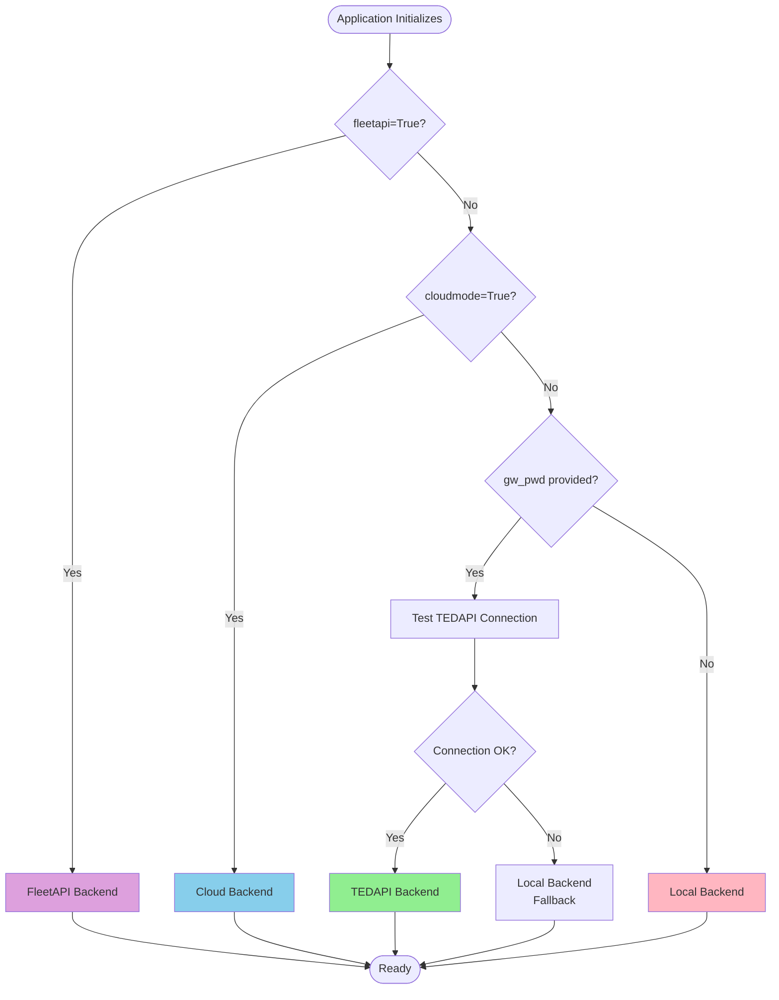

# PyPowerwall Python API Documentation

PyPowerwall is a Python library for interfacing with the Tesla Solar Powerwall Gateway. This document provides an overview of the main classes and functions available for users and developers.

---

## Getting Started

Install the library (dependencies are installed automatically; see [requirements.txt](requirements.txt)):

```sh
pip install pypowerwall
```

Import the library in your Python code:

```python
import pypowerwall
```

Create a Powerwall instance:

```python
pw = pypowerwall.Powerwall(host="<gateway-ip>", password="<gateway-password>", email="<tesla-email>")
```

---

## Main Class: `Powerwall`

### Initialization

```python
pw = pypowerwall.Powerwall(
    host="<gateway-ip>",
    password="<gateway-password>",
    email="<tesla-email>",
    timezone="America/Los_Angeles",
    pwcacheexpire=5,
    timeout=5,
    poolmaxsize=10,
    cloudmode=False,
    siteid=None,
    authpath="",
    authmode="cookie",
    cachefile=".powerwall",
    fleetapi=False,
    auto_select=False,
    retry_modes=False,
    gw_pwd=None,
    rsa_key_path=None,
    wifi_host=None,
    tedapi_api_version="V2024_06"
)
```

**Parameters:**
- `host`: Hostname or IP of the Tesla gateway
- `password`: Customer password for gateway
- `email`: Customer email for gateway/cloud
- `timezone`: Timezone string
- `pwcacheexpire`: API cache timeout in seconds
- `timeout`: HTTPS call timeout in seconds
- `poolmaxsize`: HTTP connection pool size
- `cloudmode`: Use Tesla cloud API (default: False)
- `siteid`: Site ID for cloud mode
- `authpath`: Path to cloud auth/site files
- `authmode`: "cookie" or "token" (default: "cookie")
- `cachefile`: Path to cache file
- `fleetapi`: Use Tesla FleetAPI (default: False)
- `auto_select`: Auto-select best connection mode
- `retry_modes`: Retry connection attempts
- `gw_pwd`: Full gateway password from QR sticker (used for TEDAPI and v1r modes; last 5 chars auto-derived for Basic login)
- `rsa_key_path`: Path to RSA-4096 private key for v1r LAN TEDAPI mode (Powerwall 3 wired LAN)
- `wifi_host`: Optional WiFi TEDAPI host used as fallback transport for follower queries in v1r mode
- `tedapi_api_version`: TEDAPI query/protobuf set — `"V2024_06"` (default, legacy QueryType path) or `"V2026_06"` (Tesla-signed GraphQL / bearer path)

---

## Common Methods

### System and Status

- `is_connected()` → bool  
  Returns True if able to connect and login to Powerwall.

- `status(param=None, jsonformat=False)` → dict/str/None  
  Returns system status. If `param` is provided, returns only that parameter.

- `site_name()` → str/None  
  Returns the site name.

- `version(int_value=False)` → str/int/None  
  Returns firmware version (as string or int).

- `uptime()` → str/None  
  Returns system uptime as a duration string (e.g. `62h48m24s`).

- `din()` → str/None  
  Returns the system DIN.

### Raw API Access

- `poll(api, jsonformat=False, raw=False, recursive=False, force=False)` → dict/str/None  
  Returns data from the specified Powerwall API endpoint (e.g. `/api/meters/aggregates`). Returns a dict by default, or a JSON string if `jsonformat=True`. Set `raw=True` for the raw response payload and `force=True` to bypass the cache.

- `post(api, payload, din=None, jsonformat=False, raw=False, recursive=False)` → dict/str/None  
  Sends a POST payload (dict) to the specified Powerwall API endpoint. Returns a dict by default, or a JSON string if `jsonformat=True`.

#### Tesla tariff and Time-of-Use settings

Tariff read and Time-of-Use write are Tesla cloud features. Cloud and FleetAPI modes provide them; TEDAPI returns an empty mock tariff (`{}`) and fails writes with `None`; local mode returns `None` for both (the gateway has no tariff endpoint).

- `pw.get_tariff(force=False)` (or `pw.poll("/api/tesla/tariff_rate")`) → dict/None  
  Returns the site's utility tariff object (`code`, `name`, `utility`, `currency`, `seasons`, `energy_charges`, …). Cloud reads the Owner API tariff (`SITE_TARIFF`); FleetAPI reads `tariff_content` from site info. Cached for the normal cloud TTL unless `force=True`.

- `pw.set_tariff(tou_settings)` (or `pw.post("/api/tesla/time_of_use_settings", {"tou_settings": ...})`) → dict/None  
  Updates the Time-of-Use tariff. `tou_settings` follows Tesla's `time_of_use_settings` contract, which takes the tariff as `tariff_content_v2`:

```python
result = pw.set_tariff({
    "optimization_strategy": "economics",
    "tariff_content_v2": {
        # Tesla tariff content (v2 form)
    },
})
# {"Message": "Updated", "Code": 201}, or None on failure
```

  `tariff_content_v2` is the same structure as the object `get_tariff()` returns plus a `version` field (FleetAPI site info exposes both forms), so build the write from the v2 form rather than assuming the read result can be written back unchanged.

Tesla response envelopes are normalized, including embedded JSON strings, so successful writes return a stable dictionary. A successful write invalidates the cached tariff, so the next read is fresh.

Cloud mode also recovers when Tesla replaces or re-provisions a site: if a site call returns 404 and the site ID is gone from the account's site list, pypowerwall switches to the site with the same `gateway_id` (or a unique `site_name` match), or to the only site on a single-site account, persists the new ID to `.pypowerwall.site`, and retries the call once. With several sites and no match it leaves the site unchanged and logs an error rather than guessing. Recovery is serialized and rate-limited to one attempt per minute.

### Power and Energy

- `level(scale=False)` → float/None  
  Returns battery power level percentage. Tesla reserves 5% of battery capacity as a buffer, so:
  - `scale=False` (default): Returns actual battery level including the 5% reserve
  - `scale=True`: Returns Tesla app-style percentage using formula `(level / 0.95) - (5 / 0.95)` to show percentage of *usable* capacity (matches Tesla App)

- `power()` → dict  
  Returns power data for site, solar, battery, and load.

- `site(verbose=False)` → dict  
  Returns site sensor data (W or raw JSON if verbose=True).

- `solar(verbose=False)` → dict  
  Returns solar sensor data (W or raw JSON if verbose=True).

- `battery(verbose=False)` → dict  
  Returns battery sensor data (W or raw JSON if verbose=True).

- `load(verbose=False)` → dict  
  Returns load sensor data (W or raw JSON if verbose=True).

- `grid(verbose=False)` → dict  
  Alias for `site()`.

- `home(verbose=False)` → dict  
  Alias for `load()`.

### Device and System Data

- `vitals(jsonformat=False)` → dict/str  
  Returns Powerwall device vitals.

- `strings(jsonformat=False, verbose=False)` → dict/str  
  Returns solar panel string data.

- `temps(jsonformat=False)` → dict/str  
  Returns Powerwall temperatures in degrees C, keyed by device. Powerwall 2 reports the thermal controller ambient (`TETHC--…` keys). Powerwall 3 reports the hottest battery-pack reading (`TEPOD--…` keys, one per Powerwall 3 and expansion pack; a battery without a reading appears as `None` while others report one, so positions match the proxy's `/pod` numbering, and a system with no readings returns `{}`). The full Powerwall 3 breakdown is in `vitals()`: `HVP_PackTempMax`, `HVP_PackTempMin`, `HVP_ShuntTemperature`, and the over-temperature event counters `BMS_LOG_tempOutOfBounds` / `BMS_LOG_tempOutOfBoundsCharge` on each `TEPOD--…` block, and the inverter's `PCH_AmbientTemp` (enclosure) and `PCH_heatsinkTemp` on each `TEPINV--…` block (`None` when the gateway doesn't report them; `PCH_heatsinkTemp` is passed through as delivered but reads a constant value on current firmware). Powerwall 3 temperatures need the default `tedapi_api_version="V2024_06"`.

- `alerts(jsonformat=False, alertsonly=True)` → list/str  
  Returns array of alerts from devices.

- `system_status(jsonformat=False)` → dict/str  
  Returns the system status.

- `battery_blocks(jsonformat=False)` → dict/str  
  Returns battery-specific information merged from system status and vitals.

- `grid_status(output_type="string")` → str/int/None  
  Returns the power grid status. `output_type` can be "string" (default), "json", or "numeric" (the old `type` parameter is deprecated).
    - "string": "UP", "DOWN", "SYNCING"
    - "numeric": -1 (Syncing), 0 (DOWN), 1 (UP)

### Battery and Operation

- `get_reserve(scale=True, force=False)` → float/None
  Get battery reserve percentage.

- `get_mode(force=False)` → str/None
  Get current battery operation mode.

- `set_reserve(level)` → dict/None
  Set battery reserve percentage (0-100).

- `set_mode(mode)` → dict/None
  Set current battery operation mode (`self_consumption`, `backup`, `autonomous`).

- `set_operation(level=None, mode=None, jsonformat=False)` → dict/str/None
  Set battery reserve percentage and/or operation mode.

- `get_time_remaining()` → float/None
  Get the backup time remaining on the battery (in hours).

### Grid and Export

- `set_grid_charging(mode)` → dict/None
  Enable or disable grid charging (`mode` = True/False).

- `get_grid_charging()` → bool/None
  Get the current grid charging mode.

- `set_grid_export(mode)` → dict/None
  Set grid export mode (`mode` = "battery_ok", "pv_only", "never").

- `get_grid_export()` → str/None
  Get the current grid export mode.

### Backup Events (v1r mode only)

- `schedule_max_backup(duration_seconds=7200)` → dict/None
  Schedule a manual backup event (max backup / storm watch mode) for the given duration.

- `cancel_max_backup()` → dict/None
  Cancel the current manual backup event.

- `get_backup_events()` → dict/None
  Get current backup events.

### Grid Island Control

> ⚠️ **WARNING — USE WITH EXTREME CARE.** These commands physically operate your home's grid contactor. `go_off_grid()` disconnects your home from the utility grid: expect a brief transition (including a ~30s solar dropout), and your home then runs solely on battery + solar until you reconnect. If the battery is depleted while islanded, **your home loses power**. Do not automate these commands without understanding the failure modes (script crashes while off-grid, depleted battery, gateway unreachable for the reconnect). Test only when someone is present, never during critical loads (medical equipment, etc.), and always verify grid status after issuing a command rather than assuming it succeeded.

- `go_off_grid(confirm=False)` → dict/None
  Physically disconnect the Powerwall from the grid (open contactor), islanding the home. Requires explicit confirmation — pass `confirm=True` to send the command.

- `reconnect_grid()` → dict/None
  Reconnect the Powerwall to the grid (close contactor).

Both return `{"mode": ..., "force": ..., "result": ...}` on send, or `None` on failure/unsupported backend. A `result` of `1` is the observed success value; treat anything else (or a missing result) as suspect and verify actual grid status (e.g. `grid_status()`).

Supported paths: **Tesla Cloud / FleetAPI** (signed RoutableMessage via the device_command endpoint), and — as of v0.17.3 — **locally in v1r mode** (Powerwall 3 wired LAN with a registered RSA key), which sends Tesla's signed `setIslandMode` command over TEDAPI with no cloud dependency. Hardware-validated on PW3. Not available in basic/bearer TEDAPI or plain local mode.

> **v1r LAN Control:** In v1r mode (Powerwall 3 wired LAN with RSA key), all control methods work directly over the local network — reserve/mode settings via config file writes, backup events and grid island control via Tesla's signed TEG commands — no cloud API or Tesla account needed. In other modes (WiFi TEDAPI, local), control requires FleetAPI or Cloud API access.

---

## Example Usage

### Local Mode (Powerwall 2/+)

```python
import pypowerwall

pw = pypowerwall.Powerwall(host="10.0.1.99", password="yourpassword", email="your@email.com")

if pw.is_connected():
    print("Connected to Powerwall!")
    print("Site Name:", pw.site_name())
    print("Battery Level:", pw.level())
    print("Grid Status:", pw.grid_status())
    print("Alerts:", pw.alerts())
else:
    print("Failed to connect to Powerwall.")
```

### v1r LAN Mode (Powerwall 3 — full local control)

```python
import pypowerwall

pw = pypowerwall.Powerwall(
    host="10.42.1.40",                              # Powerwall vendor subnet IP
    gw_pwd="ABCDEXXXXX",                            # Full gateway password from QR sticker
    rsa_key_path="/path/to/tedapi_rsa_private.pem"   # RSA key from v1r_register.py
)

# Monitor
print("Battery:", pw.level(), "%")
print("Power:", pw.power())
print("Vitals:", pw.vitals())

# Read control settings
print("Mode:", pw.get_mode())
print("Reserve:", pw.get_reserve())
print("Grid Charging:", pw.get_grid_charging())
print("Grid Export:", pw.get_grid_export())

# Set control values (no cloud needed)
pw.set_mode("self_consumption")
pw.set_reserve(20)
pw.set_grid_charging(False)
pw.set_grid_export("pv_only")
```

---

## Advanced Topics

- **Cloud Mode:** Set `cloudmode=True` and provide your Tesla account email to use the Tesla Cloud API.
- **FleetAPI:** Set `fleetapi=True` to use Tesla FleetAPI (requires setup).
- **TEDAPI:** Use `gw_pwd` for TEDAPI mode (advanced/local diagnostics).
- **v1r LAN:** Use `gw_pwd` + `rsa_key_path` for Powerwall 3 wired LAN access with full local control.
- **Caching:** The library caches API responses for 5 seconds by default (`pwcacheexpire`).
- **Authentication:** Supports both cookie and bearer token authentication (`authmode`).

---

## Requirements

- Python 3.8+ (3.9+ for the proxy server)
- Python packages listed in [requirements.txt](requirements.txt)

Install requirements:

```sh
pip install -r requirements.txt
```

## TeslaPy

**Note:** TeslaPy is included as a patched fork within pypowerwall and does not need to be installed separately. The fork was created because the original project is mostly unmaintained and necessary bug fixes were not being accepted by the maintainers. You can access it if needed:

```python
from pypowerwall.cloud import teslapy
```

---

## Architecture

pypowerwall uses a modular architecture with multiple backend implementations and a sophisticated multi-tier caching system to optimize performance and reliability.

### Component Overview

The library consists of several key components:

- **Powerwall (Main Class)**: High-level interface that automatically selects the appropriate backend
- **PyPowerwallBase**: Abstract base class defining the core API interface
- **Backend Implementations**: 
  - **TEDAPI** - Tesla Energy Device API for local communication via gateway
  - **Local** - Legacy local API for older Powerwall firmware
  - **Cloud** - Tesla Cloud API for remote access
  - **FleetAPI** - Tesla Fleet API for third-party integrations
- **Proxy Server**: HTTP server that wraps pypowerwall and adds performance caching

### Class Hierarchy


```mermaid
classDiagram
    class Powerwall {
        +__init__(host, password, email, ...)
        +poll()
        +power()
        +battery_blocks()
        Backend selection logic
    }
    
    class PyPowerwallBase {
        <<abstract>>
        +poll()
        +level()
        +power()
        +vitals()
        +strings()
    }
    
    class TEDAPI {
        +gw_pwd authentication
        +protobuf communication
        +network call cache (30s)
        +vitals streaming
    }
    
    class Local {
        +cookie/bearer auth
        +legacy endpoints
        +older firmware support
    }
    
    class Cloud {
        +Tesla account auth
        +remote access
        +Included TeslaPy fork
    }
    
    class FleetAPI {
        +third-party auth
        +fleet endpoints
        +vehicle integration
    }
    
    Powerwall --> PyPowerwallBase : uses
    TEDAPI --|> PyPowerwallBase : implements
    Local --|> PyPowerwallBase : implements
    Cloud --|> PyPowerwallBase : implements
    FleetAPI --|> PyPowerwallBase : implements
    Powerwall --> TEDAPI : uses
    Powerwall --> Local : uses
    Powerwall --> Cloud : uses
    Powerwall --> FleetAPI : uses
```

### Data Flow and Caching Architecture

pypowerwall implements a 3-tier caching system for optimal performance:


```mermaid
sequenceDiagram
    participant App as Application
    participant Proxy as Proxy Server
    participant Base as Powerwall/Base
    participant Backend as TEDAPI/Local/Cloud
    participant GW as Gateway/Cloud API
    
    Note over Proxy: Layer 3: Performance Cache<br/>(5s default, configurable)
    Note over Base: Layer 2: No Caching<br/>(Clean API)
    Note over Backend: Layer 1: Network Cache<br/>(5s default, configurable)
    
    App->>Proxy: GET /freq
    
    alt Cache Hit (< 5s)
        Proxy-->>App: Cached Response (~1ms)
    else Cache Miss
        Proxy->>Base: frequency()
        Base->>Backend: vitals()
        
        alt Network Cache Hit (< 5s)
            Backend-->>Base: Cached Data
        else Network Cache Miss
            Backend->>GW: API Request
            GW-->>Backend: Fresh Data
            Backend->>Backend: Store in cache
        end
        
        Backend-->>Base: Data
        Base-->>Proxy: Processed Data
        Proxy->>Proxy: Cache for 5s
        Proxy-->>App: Fresh Response (~900ms)
    end
```

### Connection Mode Selection

The Powerwall class automatically selects the appropriate backend based on configuration:


```mermaid
flowchart TD
    Start([Application Initializes]) --> CheckFleet{fleetapi=True?}
    CheckFleet -->|Yes| Fleet[FleetAPI Backend]
    CheckFleet -->|No| CheckCloud{cloudmode=True?}
    CheckCloud -->|Yes| Cloud[Cloud Backend]
    CheckCloud -->|No| CheckPassword{gw_pwd provided?}
    CheckPassword -->|Yes| TestTEDAPI[Test TEDAPI Connection]
    CheckPassword -->|No| Local[Local Backend]
    
    TestTEDAPI --> TEDAPI_OK{Connection OK?}
    TEDAPI_OK -->|Yes| TEDAPI[TEDAPI Backend]
    TEDAPI_OK -->|No| FallbackLocal[Local Backend<br/>Fallback]
    
    Fleet --> Done([Ready])
    Cloud --> Done
    TEDAPI --> Done
    Local --> Done
    FallbackLocal --> Done
    
    style TEDAPI fill:#90EE90
    style Cloud fill:#87CEEB
    style Fleet fill:#DDA0DD
    style Local fill:#FFB6C1
```

### Backend Comparison

| Feature | TEDAPI | Local | Cloud | FleetAPI |
|---------|--------|-------|-------|----------|
| **Connection** | Local Gateway | Local Gateway | Internet | Internet |
| **Authentication** | Gateway Password | Cookie/Token | Tesla Account | OAuth Token |
| **Firmware Support** | Recent (23.44.0+) | Legacy | All | All |
| **Response Speed** | Fast (~300ms) | Fast (~300ms) | Slower (~1-2s) | Slower (~1-2s) |
| **Vitals Streaming** | Yes | Limited | No | Limited |
| **Offline Operation** | Yes | Yes | No | No |
| **Network Cache** | Yes (5s) | No | No | No |
| **Best For** | PW3, Recent PW2+ | Older Systems | Remote Access | Third-party Apps |

### Caching Strategy

pypowerwall implements intelligent caching at multiple levels:

**Layer 1: Backend Network Cache** (TEDAPI only)
- Default TTL: 5 seconds (configurable via `pwcacheexpire`)
- Caches raw API responses from gateway
- Reduces network calls for repeated requests
- Logs cache age/expire for debugging

**Layer 2: Base Library**
- No caching (by design)
- Clean API boundary
- Always returns fresh data from backend
- Simplifies testing and reasoning

**Layer 3: Proxy Server Performance Cache**
- Default TTL: 5 seconds (configurable via `PW_CACHE_EXPIRE`)
- Caches processed responses for high-frequency endpoints
- Dramatically improves response time (900ms → <1ms)
- Used for: `/aggregates`, `/csv`, `/freq`, `/pod`, `/json`, `/vitals`, `/strings`, `/temps/pw`, `/alerts/pw`
- Separate cache keys per endpoint
- Thread-safe with locks

**Layer 3b: Proxy Graceful Degradation Cache**
- Default TTL: 30 seconds (configurable via `PW_CACHE_TTL`)
- Stores last successful response
- Used when gateway is unreachable
- Prevents service interruption during brief outages

### Example: Request Flow for `/freq`

1. **Application** makes HTTP request to proxy server
2. **Proxy** checks performance cache (5s TTL)
   - If hit: Returns cached data immediately (~1ms)
   - If miss: Proceeds to step 3
3. **Proxy** calls multiple pypowerwall methods:
   - `system_status()` - battery blocks
   - `vitals()` - detailed metrics
   - `grid_status()` - grid connection state
4. **Base Library** forwards calls to backend (no caching)
5. **TEDAPI Backend** checks network cache (5s TTL)
   - If hit: Returns cached data
   - If miss: Makes protobuf API call to gateway
6. **Response** flows back through layers
7. **Proxy** caches processed response for 5 seconds
8. **Application** receives consolidated frequency data

This architecture provides:
- **Performance**: Sub-millisecond cached responses
- **Reliability**: Graceful degradation during outages
- **Flexibility**: Multiple backend support
- **Observability**: Cache logging for debugging

---

## More Information

- [GitHub Repository](https://github.com/jasonacox/pypowerwall)
- [CONTRIBUTING.md](CONTRIBUTING.md)
- [RELEASE.md](RELEASE.md)
