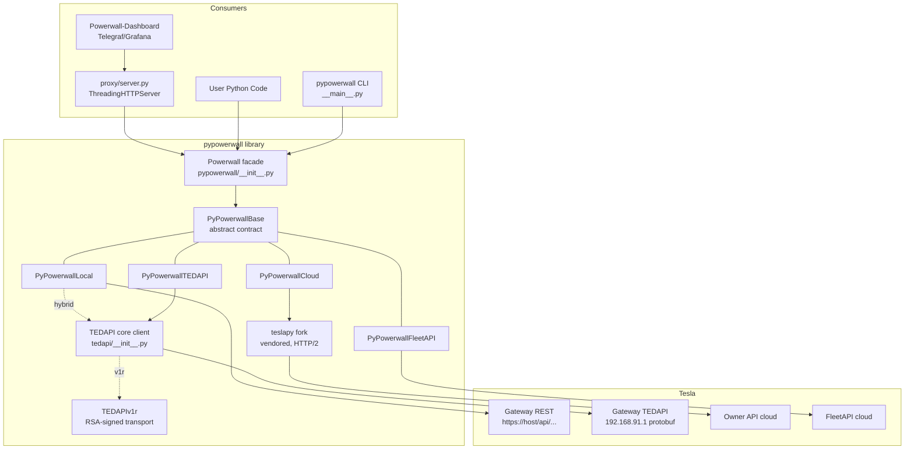

# pypowerwall Design Document

This document describes the architecture, design patterns, and implementation details of the pypowerwall library and its proxy server. It is intended for contributors and AI code agents; see [AGENTS.md](AGENTS.md) for hands-on development guidelines.

## Table of Contents

1. [Architecture Overview](#architecture-overview)
2. [Component Diagram](#component-diagram)
3. [Connection Modes](#connection-modes)
4. [Data Flow](#data-flow)
5. [Caching Layers](#caching-layers)
6. [Module Reference](#module-reference)
7. [Key Design Patterns](#key-design-patterns)
8. [Error Handling Conventions](#error-handling-conventions)
9. [Threading Model](#threading-model)
10. [Proxy Server](#proxy-server)
11. [Testing Strategy](#testing-strategy)
12. [Versioning & Release](#versioning--release)
13. [Key Invariants](#key-invariants)

---

## Architecture Overview

pypowerwall is a Python library that provides a unified API for Tesla Powerwall energy gateways across five different transport mechanisms (local gateway REST, Tesla Owner API cloud, Tesla FleetAPI, TEDAPI over gateway WiFi, and RSA-signed TEDAPI over wired LAN for PW3).

The central design idea: **the local gateway's `/api/...` URI namespace is the universal internal API**. The `Powerwall` facade class and the proxy server speak only in those URIs. Each backend either passes them through natively (local mode) or *translates* them — fetching from its own transport and fabricating a response with the same shape the local gateway would return. This is what lets tools like Powerwall-Dashboard work identically regardless of connection mode.

```
                 ┌─────────────────────────────┐
   User code ──▶ │  Powerwall (facade)         │  pypowerwall/__init__.py
   Proxy    ──▶  │  mode selection, validation │
                 │  convenience methods        │
                 └──────────────┬──────────────┘
                                │ self.client (PyPowerwallBase)
        ┌───────────────┬───────┴───────┬───────────────┐
        ▼               ▼               ▼               ▼
  PyPowerwallLocal PyPowerwallCloud PyPowerwallFleetAPI PyPowerwallTEDAPI
  (gateway REST)   (Owner API via   (Tesla FleetAPI)   (protobuf; full,
  + optional       bundled teslapy)                    hybrid helper, or
  TEDAPI hybrid                                        v1r RSA transport)
```

## Component Diagram



## Connection Modes

| Mode | Trigger | Backend class | Transport |
|------|---------|---------------|-----------|
| **local** | `host` + customer `password` | `PyPowerwallLocal` | Gateway REST (`https://<host>/api/...`), cookie or bearer auth |
| **hybrid** | `host` + `password` + `gw_pwd`, host is `192.168.91.1` | `PyPowerwallLocal` with embedded `TEDAPI` | REST for most data; TEDAPI for vitals |
| **tedapi (full)** | `gw_pwd` only, no customer password | `PyPowerwallTEDAPI` | Protobuf to `192.168.91.1` |
| **v1r** | `rsa_key_path` set (PW3 wired LAN) | `PyPowerwallTEDAPI` with `TEDAPIv1r` transport | RSA-4096-signed RoutableMessage; optional `wifi_host` fallback |
| **cloud** | `cloudmode=True` or empty `host` | `PyPowerwallCloud` | Tesla Owner API via bundled teslapy |
| **fleetapi** | `fleetapi=True` | `PyPowerwallFleetAPI` | Tesla FleetAPI (OAuth) |

Mode resolution happens in two stages:

1. **`Powerwall.__init__`** ([pypowerwall/__init__.py](pypowerwall/__init__.py)) — determines the initial `self.mode` from parameters. With `auto_select=True`: prefer local if `host` is set, else fleetapi if `.pypowerwall.fleetapi` exists in `authpath`, else cloud if `.pypowerwall.auth` exists. Then `_validate_init_configuration()` validates host/email formats and file-path writability, raising `PyPowerwallInvalidConfigurationParameter` on error.
2. **`Powerwall.connect(retry)`** — tries the selected mode; on failure, degrades circularly: local → fleetapi → cloud → local (up to 3 attempts; with `retry_modes=True` it sleeps 30s after each cycle and retries indefinitely). A backend signals failure by **raising** from `authenticate()` — that is the fallback trigger. On success, `self.client` holds the connected backend.

Within local mode, `connect()` further selects: `rsa_key_path` set → v1r; `gw_pwd` without password → full TEDAPI (customer password auto-derived as `gw_pwd[-5:]` for v1r); both passwords → hybrid.

## Data Flow

Example: `pw.power()`

1. `Powerwall.power()` delegates to `self.client.power()` (defined once in `PyPowerwallBase`).
2. Base `power()` calls `self.poll('/api/meters/aggregates')` and parses the four channels (`site`, `solar`, `battery`, `load`) into instant-power floats (defaulting to `0.0` on parse errors).
3. `poll()` behavior depends on the backend:
   - **Local**: check `pwcache` TTL (default 5s) and `pwcooldown` (5-min backoff after HTTP 429/503), then GET via a persistent `requests.Session` (`verify=False`, connection pool). 401/403 triggers one re-login (guarded by the `recursive` flag); 404 negative-caches for 600s.
   - **Cloud / FleetAPI / TEDAPI**: `poll()` is a dict dispatch — `self.poll_api_map.get(api)` maps the local URI to a `get_api_*` handler that fetches from the native transport and fabricates a local-shaped response (often via `stubs.py` templates). Unknown URIs return `{"ERROR": "Unknown API: ..."}`.
4. Write path: `Powerwall.set_operation()` → `post('/api/operation', ...)`; on success every backend calls `_invalidate_cache(api)`, driven by `WRITE_OP_READ_OP_CACHE_MAP` in [pypowerwall_base.py](pypowerwall/pypowerwall_base.py), so subsequent reads re-fetch.

## Caching Layers

There are up to four cache layers between a dashboard and the gateway:

1. **Backend `pwcache`** (library) — per-URI response cache, TTL `pwcacheexpire` (default 5s). Local mode also negative-caches 404s (600s) and rate-limit cooldowns (300s). TEDAPI has separate TTLs for status (`pwcacheexpire`) and config (`pwconfigexpire`).
2. **TEDAPI per-function locks** — the `@uses_api_lock` decorator attaches a `threading.Lock` to each fetch function; callers use `acquire_lock_with_backoff()` (native lock timeout; raises `TimeoutError`, which call sites convert to cached data or `None`) and double-check the cache under the lock, so concurrent callers don't stampede the gateway.
3. **Proxy performance cache** (`cached_route_handler` in [proxy/server.py](proxy/server.py)) — short-TTL response cache for hot routes (`/aggregates`, `/csv`, `/freq`, `/pod`, `/json`, `/vitals`, `/strings`, `/temps/pw`, `/alerts/pw`).
4. **Proxy graceful-degradation cache** (`safe_endpoint_call`) — last-known-good responses served during gateway outages, TTL `PW_CACHE_TTL` (default 30s), size-capped.

## Module Reference

### Library (`pypowerwall/`, ~14k LOC)

| Module | Responsibility |
|--------|----------------|
| `__init__.py` | `Powerwall` facade: mode selection, validation, all public convenience methods, `set_debug()`, `version_tuple` (single source of version truth) |
| `pypowerwall_base.py` | `PyPowerwallBase` abstract contract; shared `power()`/`fetchpower()`; `parse_version()`; write→read cache-invalidation map |
| `local/pypowerwall_local.py` | Local gateway REST backend; cookie/token auth; protobuf vitals decode; optional embedded TEDAPI (hybrid) |
| `cloud/pypowerwall_cloud.py` | Owner API backend via vendored teslapy; `.pypowerwall.auth` / `.pypowerwall.site` files |
| `cloud/teslapy/` | Bundled TeslaPy fork (HTTP/2 via httpx, TLS pinning) — patched, do not replace with PyPI TeslaPy |
| `fleetapi/fleetapi.py` + `pypowerwall_fleetapi.py` | Raw FleetAPI OAuth client (`.pypowerwall.fleetapi`) + backend shim |
| `tedapi/__init__.py` | Core TEDAPI protobuf client (GraphQL-in-protobuf, gzip for fw 25.42.2+, PW3 vitals, WiFi fallback) |
| `tedapi/pypowerwall_tedapi.py` | TEDAPI backend fabricating `/api/*` responses from TEDAPI config/status |
| `tedapi/tedapi_v1r.py` | `TEDAPIv1r` RSA-signed wired-LAN transport (PW3) |
| `{cloud,fleetapi,tedapi}/mock_data.py`, `stubs.py`, `decorators.py`, `exceptions.py` | Per-backend trio: canned JSON for unimplementable endpoints, response templates, `@not_implemented_mock_data` warn-once decorator, typed exceptions |
| `api_lock.py` | Lock acquisition with jittered exponential backoff (`acquire_lock_with_backoff`) |
| `tesla_auth.py` | PKCE WebView login helper (macOS) for code-exchange access tokens |
| `v1r_register.py` | RSA key registration flow for v1r LAN access |
| `scan.py` | Network scanner (`pypowerwall scan`) |
| `__main__.py` | CLI: `setup`, `login`, `authtoken`, `fleetapi`, `tedapi`, `register`, `scan`, `set`, `get`, `version`, `cloudcheck` |

### Non-package

| Directory | Purpose |
|-----------|---------|
| `proxy/` | HTTP proxy server (own build tag, own RELEASE.md/API.md, Docker image `jasonacox/pypowerwall`) |
| `pwsimulator/` | Powerwall simulator (fakes gateway REST + TEDAPI on :443); Docker image `jasonacox/pwsimulator`; used by CI |
| `tools/` | One-off utilities and protocol experiments (protobuf decoding, v1r tests, `gen_proto.sh`) |
| `examples/`, `example.py` | Usage examples; `example.py` doubles as the CI simulator integration test |

## Key Design Patterns

- **Facade + polymorphic backends**: `Powerwall` never speaks HTTP; everything goes through `self.client` (a `PyPowerwallBase`). The abstract contract is six methods: `authenticate()`, `close_session()`, `poll()`, `post()`, `vitals()`, `get_time_remaining()`.
- **API-map dispatch shim**: non-local backends map local URI strings to handlers via `init_poll_api_map()` / `init_post_api_map()` dicts. Adding an endpoint means adding the same key to all three maps (see AGENTS.md).
- **Three-tier response fidelity** per backend: (a) real responses computed from live backend data via deep-copied `stubs.py` templates; (b) harmless no-ops (`api_login_basic`); (c) canned `mock_data.py` JSON behind `@not_implemented_mock_data`, which warns once per function then goes quiet.
- **Compat fabrication**: the TEDAPI backend synthesizes `/api/status` from config VIN/firmware and maps TEDAPI islanding alerts to legacy `grid_status` strings, so consumers can't tell it isn't a local gateway.
- **Version gating**: `parse_version()` converts firmware strings to comparable ints (`"23.44.0"` → 23440), e.g. to disable the vitals protobuf API on firmware ≥ 23.44.
- **Optional capability duck-typing**: facade methods like `go_off_grid()` check `hasattr(self.client, ...)` rather than extending the abstract contract.

## Error Handling Conventions

These conventions are load-bearing — the proxy and downstream dashboards depend on them:

- **Read methods return `None` on failure** (timeouts, parse errors, missing keys). They do not raise to callers. Callers defend with `self.vitals() or {}`.
- **Dispatch backends return `{"ERROR": "Unknown API: ..."}`** for unmapped URIs (a dict, not `None`).
- **Configuration errors raise** typed exceptions (`PyPowerwallInvalidConfigurationParameter`; `ValueError` for invalid enum-like arguments).
- **`authenticate()` raises on failure** — that exception is the signal that drives mode fallback in `connect()`.
- **Rate limiting**: HTTP 429/503 → 5-minute cooldown; 404 → 10-minute negative cache.
- **The proxy never lets an exception reach the client**: `safe_pw_call()` converts all library exceptions to `None` plus categorized, rate-limited logging.

Known wart (do not "fix" casually — return shapes are public API): failure shapes are not fully consistent across methods and endpoints (`None` vs `0.0` vs `{}` vs `[]` vs the proxy's literal `TIMEOUT!` body). Changes here need a deprecation plan.

### Known cross-backend inconsistencies

These shapes differ between backends but are **frozen public API** — downstream consumers
(Powerwall-Dashboard, Telegraf configs) depend on the current behavior of the backend they
run against. Do not harmonize without a deprecation plan.

| Surface | local | tedapi | cloud / fleetapi |
|---|---|---|---|
| `get_time_remaining()` when unknown | `None` | `None` | `0.0` |
| `status()['git_hash']` | real value | `None` | hard-coded fake hash |
| `grid_status()` reachable states | 7 states (UP, DOWN, SYNCING, ...) | UP/DOWN | UP/DOWN |
| `system_status()['battery_blocks']` | real list | synthesized list | `[]` stub |

Proxy-level inconsistencies (equally frozen):

- `/fans` returns `null` on failure but `/fans/pw` returns `{}`.
- Some GET error bodies return HTTP 200 with a literal error body (e.g. `TIMEOUT!`),
  while POST errors map to 400/401.
- `/soe` returns the raw gateway percentage; `/api/system_status/soe` returns the
  Tesla-app scale — two different values for the same metric.
- TEDAPI `vitals()` emits `TESYNC--None--None` and `TESLA--None` blocks when the SYNC
  bus is absent (typical PW3). The names look like garbage, but `TESLA--None`'s
  `componentParentDin` (`STSTSM--<vin>`) is the only place the gateway DIN/serial
  appears in TEDAPI vitals — consumers depend on it. Do not "clean up" these blocks
  (verified by hardware regression during the v0.16.0 review).

## Threading Model

- The **library** is used concurrently by the proxy's `ThreadingHTTPServer`. Shared state that matters: backend `pwcache` dicts (benign races — worst case a duplicate fetch), TEDAPI per-function locks (real mutual exclusion around gateway calls), and the cloud backend's `apilock` spin-flags.
- The **proxy** guards its stats with `proxystats_lock` (an `RLock`) and size-caps its tracking dicts. Request handlers must not hold any lock across a network call.
- `Powerwall.connect(retry_modes=True)` blocks the calling thread indefinitely until a connection succeeds — by design for daemon use (the proxy), but callers embedding the library should know.

## Proxy Server

[proxy/server.py](proxy/server.py) is a single-file `ThreadingHTTPServer` app, deliberately dependency-light (no Flask/FastAPI). Key structures:

- `ALLOWLIST` / `DISABLED` — which gateway `/api/*` URIs may be proxied.
- `do_GET` — a long if/elif router over `request_path` (after `PROXY_BASE_URL` prefix stripping). Aggregate routes (`/csv`, `/json`, `/pod`, `/freq`, ...) compute derived metrics; `/pw/<name>` routes dispatch via the `simple_mappings` dict.
- `do_POST` — `/control/*` write endpoints, gated by `PW_CONTROL_SECRET` token and (in most modes) a separate cloud-mode `pw_control` instance.
- `safe_pw_call` / `safe_endpoint_call` / `cached_route_handler` — the exception-absorbing and caching wrappers (see Caching Layers).
- Configuration is entirely via `PW_*` environment variables read at module import.
- Static web app (`proxy/web/`, transformed by `transform.py`) serves the Powerwall UI, injecting JS and proxying unknown paths to the gateway in local mode.

The proxy pins its library dependency (`proxy/requirements.txt`: `pypowerwall==X.Y.Z`) and runs in Docker on `python:3.10-slim` (Debian on purpose — musl TLS fingerprinting breaks Tesla token refresh; tini as PID 1 for zombie reaping).

## Testing Strategy

- **Unit tests** (`pypowerwall/tests/`): construction and mode-selection tests patch all four backend classes by name (`patch('pypowerwall.PyPowerwallTEDAPI')`, autouse fixture) so no test needs a network. `Powerwall` construction must stay mockable this way.
- **Proxy tests** (`proxy/tests/`): instantiate the handler directly with mocked `rfile`/`wfile`, `@patch('proxy.server.pw')`, and clear `_performance_cache` between tests.
- **Live tests**: marked `live` (`pytest -m "not live"` to skip); they self-skip unless a gateway is reachable.
- **Simulator integration**: CI (`simtest.yml`) runs the `pwsimulator` Docker image as a service container and executes `example.py` against it — full end-to-end without hardware. New endpoints should get a simulator handler in `pwsimulator/stub.py` to be CI-testable.
- **CI matrix**: pytest + pylint across Python 3.9–3.13; protobuf codegen consistency check; coverage to Codecov.

## Versioning & Release

- Library version lives **only** in `version_tuple` in [pypowerwall/__init__.py](pypowerwall/__init__.py); `setup.py` regex-extracts it.
- Proxy build tag lives **only** in `BUILD = "tNN"` in [proxy/server.py](proxy/server.py); reported as `"<libversion> Proxy tNN"`.
- Docker tag is the concatenation: `jasonacox/pypowerwall:0.15.13t94`.
- Release order: bump `version_tuple` → update root `RELEASE.md` → `upload.sh` (PyPI) → bump `proxy/requirements.txt` pin + `BUILD` + `proxy/RELEASE.md` → `proxy/upload.sh` (Docker Hub; it verifies the pinned version exists on PyPI first).

## Key Invariants

1. **Never break the public API.** Method signatures, return shapes (including failure shapes), local `/api/...` URI semantics, and proxy endpoint responses are all depended on by Powerwall-Dashboard and other consumers.
2. **Every non-local backend must answer the same `/api/...` URIs** — new endpoints need handlers (real, stub, or mock) in cloud, fleetapi, and tedapi maps.
3. **Read APIs return `None` on failure; `authenticate()` raises.** Don't invert either.
4. **`Powerwall` construction must not require network** — unit tests patch the backend classes by name.
5. **Writes must invalidate reads** — extend `WRITE_OP_READ_OP_CACHE_MAP` when adding a write endpoint whose result is visible through a cached read.
6. **The vendored teslapy fork is patched** (HTTP/2, TLS fingerprint). Never swap it for upstream TeslaPy.
7. **Version strings have exactly one home each** (library: `version_tuple`; proxy: `BUILD`).
