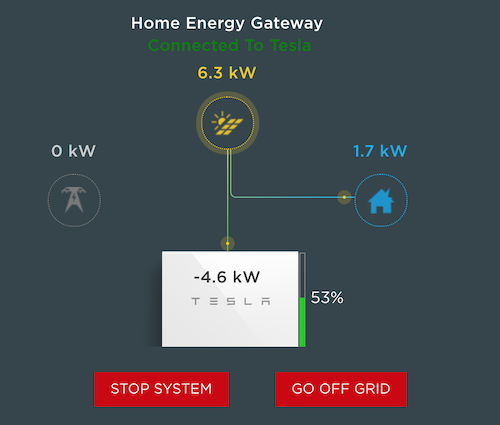

# pyPowerwall Helpful Documentation

## View Local Tesla Powerwall Portal

The Powerwall gateway has a web based portal that you can access to the power flow animation. This requires that you find the local IP address of you Powerwall.  You can do that using `pypowerwall`:


```bash
# Install pyPowerwall if you haven't already
python -m pip install pypowerwall

# Scan Network for Powerwall
python -m pypowerwall scan
```

After confirming your local network address space, it will scan your network looking for a Tesla Powerwall and respond with something like this:

```
Discovered 1 Powerwall Gateway
     10.0.1.23 [1234567-00-E--TG123456789ABC]
```

Point your browser to that address http://10.0.1.23 and you will be able to log in and see the power details and flow animation:

[](portal.png)

