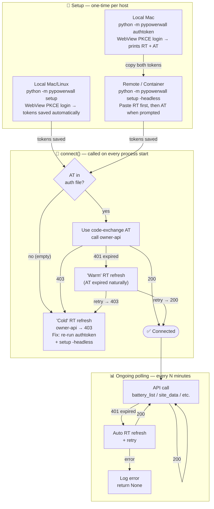

# Cloud Mode Design — Authentication Flows

> **How cloud auth works, where 403s come from, and how to debug them.**

---

## 1. Overview

Cloud mode authenticates with Tesla's OAuth 2.0 PKCE service (`auth.tesla.com`) and
then calls the Tesla Owner API (`owner-api.teslamotors.com`). There are **three distinct
setup paths** and two ongoing-use paths, all feeding into the same `connect()` entry point.



---

## 2. Setup Paths (one-time)

### Path A — Local Browser (Mac / Linux with display)

```
python -m pypowerwall setup
         │
         ▼
tesla_auth.login(headless=False)
         │
         ▼ _detect_mode()
    SSH_CLIENT/SSH_TTY set? ──Yes──► Path B
    Linux + no DISPLAY?     ──Yes──► Path B
         │ No
         ▼
    _local_login()
         │
         ├─ macOS ──► _local_login_macos()
         │              • _build_auth_url() → PKCE code_verifier + code_challenge + state
         │              • Opens NSWindow / WKWebView → loads auth.tesla.com SSO page
         │              • User logs in → Tesla redirects to tesla://auth/callback?code=…&state=…
         │              • TeslaNavDelegate.webView_decidePolicyForNavigationAction intercepts
         │              • Validates state (CSRF check)
         │              • _exchange_code(code, code_verifier)
         │                  POST https://auth.tesla.com/oauth2/v3/token  [HTTP/2, httpx]
         │                  body: grant_type=authorization_code, client_id=ownerapi,
         │                        code=…, code_verifier=…, redirect_uri=tesla://auth/callback
         │                  ← {access_token, refresh_token, expires_in, id_token, token_type}
         │              • Prints refresh_token to terminal + copies to clipboard
         │              • Auto-closes window (setup) OR shows success page (authtoken)
         │              • Reopens sys.stdin from /dev/tty (NSApplication corrupts stdin)
         │              • Returns (refresh_token, email_from_id_token, token_data_dict)
         │
         └─ Win/Linux ► _local_login_pywebview()
                         • Same PKCE flow, pywebview + monkey-patched navigation handler
                         • Returns (refresh_token, "", {})

         │
         ▼ (back in __main__.setup)
    token_data is non-empty (Path A only)
         │
         ▼
    email detected from id_token? ─No─► input("Tesla account email: ")
         │
         ▼
    save_token(token_data, path=auth_file, email=email)
         │   • Writes teslapy-compatible JSON cache file:
         │     { email: { url: "https://auth.tesla.com/",
         │                sso: { token_type, access_token, refresh_token,
         │                       expires_at, expires_in, id_token } } }
         │   • expires_at set to real expiry (now + expires_in) when access_token
         │     is present; 0 when AT is absent (forces teslapy refresh attempt)
         │
         ▼
    PyPowerwallCloud.setup(email, token_data)
         │
         ▼ connect() — see Section 4
```

---

### Path B — Headless / Remote / Docker Container

```
python -m pypowerwall setup -headless [-email=…]
         │  (also triggered automatically when SSH_CLIENT or no DISPLAY detected)
         │
         ▼
tesla_auth.login(headless=True)
         │
         ▼
    _remote_login()
         │  Prints instructions: "run python -m pypowerwall authtoken on your local Mac"
         │
         ▼
    _read_masked("Refresh Token (RT): ")
         │  • Opens /dev/tty in raw mode (bypasses 1024-byte canonical buffer limit)
         │  • Echoes '*' per character typed/pasted
         │  • Returns the full token string
         │
         ▼
    _read_masked("Access Token (AT, valid ~8h — press Enter to skip): ")
         │  • Same raw-mode input
         │  • User pastes the AT shown by 'authtoken' on local Mac
         │  • Press Enter without pasting to skip (NOT recommended — will 403 on owner-api)
         │
         ▼
    Returns (refresh_token, access_token, {})
         │   access_token may be "" if user skipped it
         │
         ▼ (back in __main__.setup)
    Saves token_data with:
         │   {"refresh_token": rt, "access_token": at, "token_type": "Bearer", "expires_in": 28800}
         │   • access_token: the code-exchange AT if provided, "" if skipped
         │   • expires_at: 0
         │
         ▼
    PyPowerwallCloud.setup(email, token_data=None)
         │
         ▼ connect() — see Section 4
```

> **Important:** `owner-api.teslamotors.com` only accepts **code-exchange ATs** (from
> the PKCE WebView login) for the **first connect**. Once a code-exchange AT has been
> used, normal token refresh via the RT works for subsequent connects. Providing the AT
> from `authtoken` is required only for the initial headless setup — after that the
> library automatically refreshes on 401.

---

### Path C — authtoken on Local Mac → copy-paste to Remote

```
[On local Mac]
python -m pypowerwall authtoken
         │
         ▼
get_authtoken(region="us")
         │  Returns (rt, at, email)
         │
         ▼
_local_login_macos(show_token_page=True)
         │  • Same WKWebView PKCE flow as Path A
         │  • After code exchange, shows success page in window:
         │    - RT first (green badge "valid 90 days") with Copy RT button
         │    - AT second (yellow badge "valid ~8h") with Copy AT button
         │  • Terminal also prints RT first, then AT
         │  • NO file is written (tokens shown only, not saved)
         │
         ▼
    [User copies RT and AT from window or terminal output]

[On remote host / in Docker container]
python -m pypowerwall setup -headless -email=user@example.com
         │
         ▼ Path B — prompted for RT (paste first), then AT (paste second)
         │          Both are saved to the auth file
```

> **Why both tokens are needed:** The RT provides long-lived re-authentication (~90 days).
> The AT (code-exchange, from the WebView PKCE login) bootstraps the session — it must be
> provided once at setup so `owner-api.teslamotors.com` recognises the token chain as
> originating from a legitimate PKCE login. After that, normal RT-based refresh works.

---

## 3. connect() Decision Tree (Section 4)

Called by `PyPowerwallCloud.authenticate()` → `connect()`:

```
connect()
    │
    ├─ auth file missing? ──► raise PyPowerwallCloudNoTeslaAuthFile
    │
    ▼
Tesla(email, cache_file=auth_file)   [teslapy]
    │  __init__ calls _token_updater() which reads cache file
    │  Sets: self.token = cache[email]['sso']
    │        self.sso_base_url = cache[email]['url']
    │
    ▼
token has refresh_token AND access_token is empty/falsy?
    │
    ├─ YES ──► Explicit refresh before teslapy's authorization check
    │          rt = self.tesla.token['refresh_token']
    │          self.tesla.refresh_token(
    │              self.tesla.auto_refresh_url,   # https://auth.tesla.com/oauth2/v3/token
    │              refresh_token=rt,
    │              **self.tesla.auto_refresh_kwargs  # {'client_id': 'ownerapi'}
    │          )
    │          → tesla.refresh_token() calls _refresh_token_http2() [see Section 5]
    │          → On success: self.token updated, _token_updater() saves to cache
    │          → On failure: log error, return False
    │
    └─ NO (access_token present and non-empty)
    │
    ▼
self.tesla.authorized?
    │  (requests_oauthlib: bool(token.get('access_token')) — empty string = False)
    │
    ├─ NO ──► Interactive browser re-auth via teslapy._authenticate()
    │         (opens webbrowser, prompts for redirect URL)
    │         → This path is only hit if both RT and AT are missing
    │
    └─ YES
    │
    ▼
getsites() → battery_list() + solar_list()
    │  → api('PRODUCT_LIST') → GET owner-api.teslamotors.com/api/1/products  [HTTP/2]
    │
    ├─ empty list ──► log error "No sites found", return False
    │
    └─ non-empty
    │
    ▼
Resolve siteid from .pypowerwall.site file (or default to first site)
Set self.site, self.siteindex
Return True
```

---

## 4. Token File Format (`.pypowerwall.auth`)

The auth file is a JSON object keyed by email address, compatible with teslapy's
cache format:

```json
{
  "user@example.com": {
    "url": "https://auth.tesla.com/",
    "sso": {
      "token_type": "Bearer",
      "access_token": "",
      "refresh_token": "eyJhbGciOiJSUzI1NiIsInR5cCI6IkpXVCIsImtpZCI6...",
      "expires_at": 0,
      "expires_in": 28800,
      "id_token": "eyJhbGciOiJSUzI1NiIsInR5cCI6IkpXVCIsImtpZCI6..."
    }
  }
}
```

**Key fields:**

| Field | Path A (browser) | Path B (headless) | Notes |
|---|---|---|---|
| `access_token` | present (code-exchange AT) | present if user pasted it; `""` if skipped | Must be code-exchange AT — refreshed ATs get 403 on owner-api |
| `refresh_token` | present | present (pasted by user) | Long-lived (~90 days), used to re-authenticate |
| `expires_at` | real expiry (`now + expires_in`) | real expiry when AT pasted; `0` if skipped | When non-zero, teslapy uses the saved AT directly; `0` triggers refresh attempt |
| `id_token` | present (JWT with email) | absent | JWT payload contains email address |

**Why save `expires_at`?** When a code-exchange access token is available, writing its
real expiry (`now + expires_in`) tells teslapy the token is still valid, preventing an
auto-refresh that would produce a 403-rejected AT. If no AT was saved (user skipped it
in `setup -headless`), `expires_at` stays `0` and `connect()` will attempt a refresh —
which will likely 403, but the error message guides the user to re-run `authtoken`.

---

## 5. Token Refresh in teslapy

`Tesla.refresh_token(token_url, refresh_token=rt, **auto_refresh_kwargs)`:

```
refresh_token()
    │
    ├─ not authorized AND no 'refresh_token' kwarg ──► raise ValueError('`refresh_token` is not set')
    │  (guard added for our headless path — we always pass refresh_token=rt explicitly)
    │
    ├─ HAS_HTTPX? ──YES──► _refresh_token_http2(token_url, **kwargs)
    │                          │
    │                          ▼
    │                   prepare_refresh_body(refresh_token=rt, scope=self.scope,
    │                                        client_id='ownerapi')
    │                   POST https://auth.tesla.com/oauth2/v3/token  [HTTP/2]
    │                   headers: Accept: application/json,
    │                            Content-Type: application/x-www-form-urlencoded
    │                   body: grant_type=refresh_token&refresh_token=…&scope=…&client_id=ownerapi
    │                          │
    │                          ├─ 200 ──► parse token, update self.token
    │                          │         if 'refresh_token' missing from response,
    │                          │         keep original rt to avoid losing it
    │                          │
    │                          └─ 4xx/5xx ──► raise HTTPError → caught by refresh_token()
    │                                         → log warning, fall through to HTTP/1.1 fallback
    │
    └─ HAS_HTTPX False OR HTTP/2 failed ──► super().refresh_token() [requests, HTTP/1.1]
                                            → If Tesla requires HTTP/2: returns 403
```

**Scope in refresh body:** `self.scope = ('openid', 'email', 'offline_access')`.
Tesla typically returns the same scopes granted at authorization time regardless of
what is requested in the refresh body, so this does NOT strip energy scopes.

---

## 6. HTTP/2 Stack

Tesla's APIs require HTTP/2 as of June 2026. The code uses:

```
auth.tesla.com endpoints (token exchange, refresh):
    tesla_auth.py:  httpx.Client(http2=True)  ← direct httpx
    teslapy:        httpx.Client(http2=True) in _fetch_token_http2()/_refresh_token_http2()

owner-api.teslamotors.com endpoints (PRODUCT_LIST, etc.):
    teslapy:        httpx.Client(http2=True) in _request_http2()
                    Falls back to requests (HTTP/1.1) if httpx fails
```

**Package chain for HTTP/2:**
```
httpx[http2] ──► installs h2 (HTTP/2 framing)
                         + httpx (HTTP client)
                         + hpack (HTTP/2 header compression)
h2 does:     frame encoding/decoding
httpx does:  ALPN negotiation ("h2" via TLS) + connection management
OpenSSL:     actual TLS + ALPN advertisement
```

If `h2` is not installed, `httpx.Client(http2=True)` raises `ImportError` at client
creation time (not a silent fallback).

---

## 7. Docker Container — 403 Root Cause Analysis

The 403 error occurs when running the headless flow inside a Docker container but
**not** on a bare remote host (VM, physical server). The setup flow is identical.
This points to a Docker / Alpine Linux environment difference.

### 7.1 Confirmed Working vs Failing

| Environment | Result | Notes |
|---|---|---|
| macOS (local) | ✅ Works | Path A or Path C via `authtoken` |
| New bare Linux VM (SSH) | ✅ Works | Path B headless |
| Docker container (Alpine, amd64) | ✅ Works (with fix) | Path B — must provide code-exchange AT |
| Docker container (Debian Bullseye, arm) | ✅ Works (with fix) | Path B — must provide code-exchange AT |

**Pre-fix behaviour (all containers):** `setup -headless` prompted for RT only → saved empty AT → `connect()` refreshed → refreshed AT → 403 from `owner-api.teslamotors.com`.

### 7.2 Candidate Root Causes (ordered by likelihood)

#### RCA-1: TLS Fingerprinting (JA3/JA4) — Most Likely

Tesla's `auth.tesla.com` sits behind Cloudflare, which actively fingerprints TLS
ClientHello messages (JA3/JA4 hashes). The fingerprint depends on:
- Cipher suite list and ordering (set by OpenSSL build)
- TLS extensions and their ordering
- EC curves supported
- TLS version negotiation

Alpine Linux uses **musl libc** and **Alpine's OpenSSL** package, which compiles
OpenSSL with different default cipher ordering than:
- macOS (uses Apple's SecureTransport or a Homebrew OpenSSL)
- Ubuntu/Debian (uses Ubuntu's OpenSSL package)

The JA3 fingerprint of Python/httpx from Alpine may match a known-blocked hash in
Cloudflare's ruleset.

**How to test:** Run `cloudcheck` both inside and outside the container and compare
the `http_version` field and `ssl_context` cipher list.

#### RCA-2: HTTP/2 Not Actually Negotiated

`httpx[http2]` installs the `h2` package for HTTP/2 *framing*, but the actual
HTTP/2 *negotiation* depends on OpenSSL advertising `h2` via ALPN in the TLS
ClientHello. If Alpine's OpenSSL does not include ALPN support or it is disabled,
`httpx` silently falls back to HTTP/1.1 even with `http2=True`.

**Signs:** `cloudcheck` shows `HTTP/1.1` instead of `HTTP/2` for `auth.tesla.com`.

**Fix:** Ensure `openssl` is installed (not just the musl default) in the Alpine
container, or switch to `python:3.10-slim-bullseye` for all platforms.

#### RCA-3: TLS 1.3 Context Creation Fails Silently

`_httpx_auth_verify()` attempts to create an SSLContext pinned to TLS 1.3 only:
```python
ctx.minimum_version = ssl.TLSVersion.TLSv1_3
ctx.maximum_version = ssl.TLSVersion.TLSv1_3
```
If this fails in Alpine (different OpenSSL build), the `except Exception: pass` block
returns the default `True` (system certs), which means the TLS context is rebuilt by
httpx with different parameters than expected. This alone shouldn't cause 403, but
it changes the fingerprint.

#### RCA-4: Proxy Environment Variables

Docker containers sometimes inherit or get injected with `HTTP_PROXY`, `HTTPS_PROXY`,
or `NO_PROXY` from the host or Docker daemon configuration. httpx respects these by
default (`trust_env=True` is the default). A misconfigured proxy could:
- Downgrade HTTP/2 to HTTP/1.1 (proxy doesn't support h2)
- Change the TLS termination point
- Add/remove headers

**How to test:** `cloudcheck` lists all proxy env vars.

#### RCA-5: Token Already Invalidated

Tesla invalidates a `refresh_token` after it is used once for a new token (sliding
window rotation). If the token was already consumed:
1. By `authtoken` on Mac → Mac got new RT and saved to clipboard
2. User pastes into container → container tries the **original** RT which is now invalid
3. Tesla returns 403

**Signs:** The exact error message differs — an invalidated token usually returns
`{"error":"invalid_request","error_description":"token is invalid"}` in the body,
not just a 403 reason phrase.

**How to test:** `cloudcheck` shows the response body, not just the HTTP status.

#### RCA-6: Missing Energy Scopes — **DISPROVEN**

Early investigation suspected `owner-api.teslamotors.com` required `energy_device_data`
and `energy_cmds` scopes. This was incorrect.

A code-exchange AT that carries **only** `["openid", "email", "offline_access"]` in its
`scp` claim returns **200** from `owner-api.teslamotors.com/api/1/products`. A refreshed
AT with the exact same `scp`, `aud`, and `x-enc` structure returns **403**. The token
content is not the differentiator — the grant type that produced it is.

**Current state:** `SCOPES = "openid email offline_access"` (energy scopes removed).

---

#### RCA-8: Code-Exchange AT Required for Cold Start — **CONFIRMED ROOT CAUSE**

`owner-api.teslamotors.com` distinguishes between two refresh scenarios:

| Scenario | Result |
|---|---|
| **Cold refresh** — RT refreshed immediately with no prior code-exchange AT in the session | ❌ 403 |
| **Warm refresh** — code-exchange AT used normally, expired (~8h), then RT refreshed | ✅ 200 |

Tesla's server preserves the token lineage from the original PKCE session. Once a
code-exchange AT has been used, subsequent RT refreshes are accepted. The 403 only
occurs on a "cold" refresh where the session was never activated by a code-exchange AT.

**Evidence:**
- Identical JWT structure (`aud`, `scp`, `x-enc` present) — server distinguishes by internal session state, not JWT content
- Code-exchange AT (from `authtoken` WebView login) → 200
- Refreshed AT immediately after RT-only setup (no prior code-exchange AT) → 403
- Refreshed AT after code-exchange AT expired naturally (~8h) → ✅ 200

**Why Path B (headless) always failed:**
The old headless flow saved only the RT with an empty AT. On first `connect()`, the empty
AT triggered an immediate "cold" refresh → refreshed AT with no session lineage → 403.

**Fix (applied):**
- `authtoken` now outputs both the **RT** (green badge, valid 90 days) and the
  **AT** (yellow badge, valid ~8h), shown RT-first in window and terminal
- `setup -headless` now prompts for RT first, then AT (required for the cold-start)
- Both tokens are saved to the auth file; `connect()` uses the code-exchange AT directly
- `connect()` now handles 401 (expired AT) by refreshing and retrying — the warm-refresh
  path works, so the service self-heals automatically after the initial ~8h
- `cloudcheck` checks `access_token` for code-exchange markers (`owner-api` in `aud`,
  `x-enc` present) and shows `✓`, `✗ EXPIRED`, or `✗ EMPTY` accordingly

#### RCA-7: Missing `h2` Package (Build Failure)

In some Alpine environments, `h2` fails to install due to build constraints. If
`pip install httpx[http2]` succeeds but `h2` is not installed, httpx raises
`ImportError: h2 must be installed to use HTTP/2` at `httpx.Client(http2=True)`
creation time. This causes `_refresh_token_http2()` to raise immediately and
fall through to the `logger.warning(...)` path, which then tries
`super().refresh_token()` using `requests` (HTTP/1.1) → 403.

**How to test:** `cloudcheck` explicitly checks `import h2` and shows the version.

### 7.3 Diagnostic Decision Tree

```
cloudcheck output shows:
    h2: NOT INSTALLED ──────────────────────────────► Fix: pip install h2
    auth.tesla.com: HTTP/1.1 (not HTTP/2) ─────────► Fix: OpenSSL ALPN issue (RCA-2)
    HTTPS_PROXY=… set ─────────────────────────────► Fix: unset proxy or configure properly
    auth.tesla.com: FAILED (connection error) ──────► Network/firewall issue
    Refresh: FAILED — 403 (with body) ─────────────► Check body for error_description
        body has "token is invalid" ───────────────► RCA-5: use fresh token (RT consumed)
        body has "unauthorized_client" ────────────► RCA-1: TLS fingerprint blocked
        body is empty HTML ────────────────────────► RCA-1: Cloudflare blocking request
    access_token: EMPTY ────────────────────────────► RCA-8: no code-exchange AT saved (cold start will 403)
        Fix: re-run authtoken on local Mac, then setup -headless with both RT and AT
    access_token: EXPIRED ──────────────────────────► AT valid ~8h; connect() will refresh on next 401
        (service self-heals automatically — no manual renewal needed)
    access_token: valid code-exchange AT ───────────► Auth file is healthy
    battery_list() → 403 despite refresh ──────────► Cold-start 403: no prior code-exchange AT
        Fix: re-run authtoken + setup -headless to bootstrap the session
```

---

## 8. Runtime Auth Flow (after setup)

Every time the proxy server starts or `PyPowerwall` is initialized in cloud mode,
`authenticate()` → `connect()` is called. This follows the same Section 3 decision
tree. The cache file is read fresh each time, and if the access_token is expired,
teslapy's `auto_refresh_url` mechanism handles renewal automatically during
`super().request()` calls.

---

## 9. Key Files and Functions

| File | Function | Role |
|---|---|---|
| `pypowerwall/__main__.py` | `main()` → `setup` branch | CLI wiring, email detection, file write |
| `pypowerwall/__main__.py` | `main()` → `authtoken` branch | Local-only token printer |
| `pypowerwall/__main__.py` | `main()` → `cloudcheck` branch | Diagnostics |
| `pypowerwall/tesla_auth.py` | `_detect_mode()` | SSH/display detection |
| `pypowerwall/tesla_auth.py` | `_build_auth_url()` | PKCE URL construction |
| `pypowerwall/tesla_auth.py` | `_exchange_code()` | Auth code → token (HTTP/2) |
| `pypowerwall/tesla_auth.py` | `_refresh_access_token()` | Standalone refresh (NOT used in connect path) |
| `pypowerwall/tesla_auth.py` | `_read_masked()` | Raw-mode terminal input (bypasses 1024B limit) |
| `pypowerwall/tesla_auth.py` | `_remote_login()` | Headless paste-token flow |
| `pypowerwall/tesla_auth.py` | `_local_login_macos()` | WKWebView PKCE on macOS |
| `pypowerwall/tesla_auth.py` | `save_token()` | Write teslapy-compatible cache file |
| `pypowerwall/cloud/pypowerwall_cloud.py` | `connect()` | Auth + site selection |
| `pypowerwall/cloud/pypowerwall_cloud.py` | `getsites()` | battery_list() + solar_list() |
| `pypowerwall/cloud/teslapy/__init__.py` | `Tesla.__init__()` | Session init, cache load |
| `pypowerwall/cloud/teslapy/__init__.py` | `refresh_token()` | Token refresh (HTTP/2 → fallback) |
| `pypowerwall/cloud/teslapy/__init__.py` | `_refresh_token_http2()` | HTTP/2 token refresh via httpx |
| `pypowerwall/cloud/teslapy/__init__.py` | `_request_http2()` | HTTP/2 owner-api calls via httpx |
| `pypowerwall/cloud/teslapy/__init__.py` | `battery_list()` | Returns Battery objects from PRODUCT_LIST |

---

## 10. Environment Variables

| Variable | Used by | Effect |
|---|---|---|
| `PW_AUTH_PATH` | `__main__.py` | Override auth file directory |
| `HTTP_PROXY` / `HTTPS_PROXY` | httpx (via `trust_env`) | Route requests through proxy |
| `NO_PROXY` | httpx (via `trust_env`) | Bypass proxy for matching hosts |
| `SSH_CLIENT` / `SSH_TTY` | `_detect_mode()` | Forces headless mode |
| `DISPLAY` / `WAYLAND_DISPLAY` | `_detect_mode()` | Presence allows local mode on Linux |
